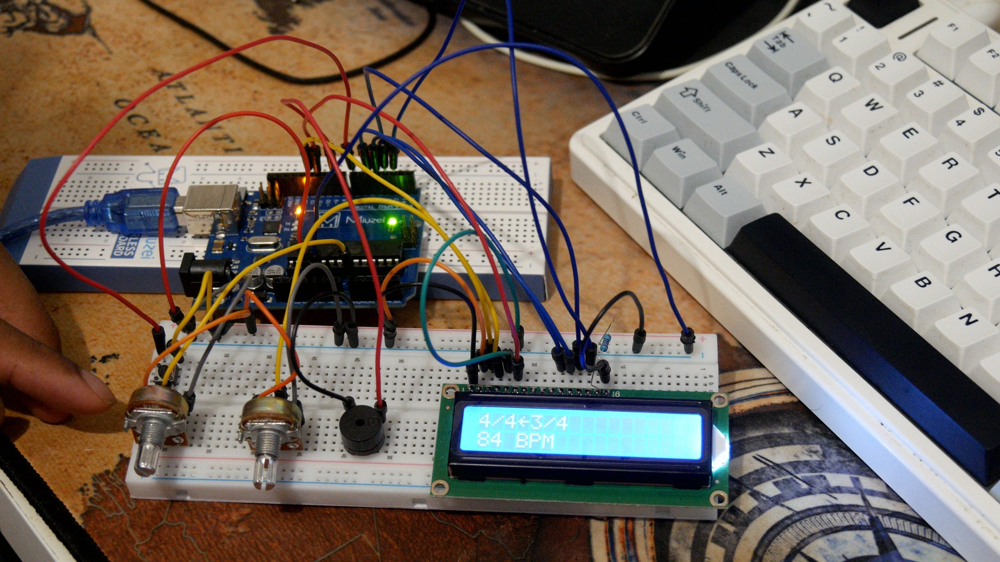

# Arduino Metronome

A compact electronic metronome built with an Arduino, a 16×2 LCD, a
potentiometer, a push button and a buzzer.

## Features

- Adjustable tempo from **40 to 200 BPM**
- **4/4** and **3/4** time signatures
- Visual selection of the active time signature on the LCD
- Higher-pitched click on the first beat of each measure
- Non-blocking beat timing with `millis()`

## Demo

[Watch the Arduino metronome demo on YouTube](https://youtu.be/4KORCXHDIKg)

## Hardware

- Arduino-compatible board
- 16×2 LCD compatible with the Hitachi HD44780 driver
- 10 kΩ potentiometer for tempo control
- Push button
- Piezo buzzer
- 10 kΩ potentiometer for LCD contrast
- Breadboard, jumper wires and suitable resistors

## Wiring

| Component | Arduino pin |
|---|---:|
| LCD RS | 12 |
| LCD Enable | 11 |
| LCD D4 | 5 |
| LCD D5 | 4 |
| LCD D6 | 3 |
| LCD D7 | 2 |
| Time-signature button | 7 |
| Buzzer | 9 |
| Tempo potentiometer | A0 |

The button uses `INPUT_PULLUP`, so it should be connected between pin 7 and
ground. Connect the LCD `R/W` and `VSS` pins to ground and `VCC` to 5 V.

## Run the project

1. Reproduce the wiring above.
2. Open `arduino-metronome.ino` in the Arduino IDE.
3. Select the correct board and port.
4. Compile and upload the sketch.
5. Turn the potentiometer to adjust the BPM and press the button to switch
   between 4/4 and 3/4.

## What I learned

- Wiring and controlling a 16×2 LCD
- Reading analog values and mapping them to a useful range
- Handling a push button with `INPUT_PULLUP`
- Managing UI state with arrays, indexes and modulo
- Scheduling repeated events without blocking the program
- Implementing 3/4 and 4/4 measures and accenting the first beat
- Debugging interactions between hardware and software

## Possible improvements

- Add more time signatures
- Add hardware debouncing for the selection button
- Design and print an enclosure
- Store the last settings in EEPROM

## License

This project is available under the [MIT License](LICENSE).
